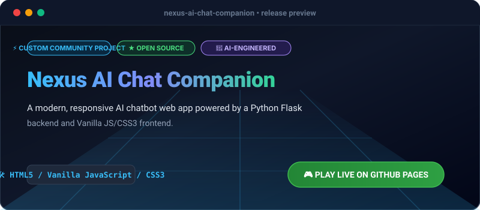

# Nexus AI Chat Companion

[](https://olamideakinade.github.io/nexus-ai-chat-companion/)
[](https://github.com/Olamideakinade/nexus-ai-chat-companion)
[](https://opensource.org/licenses/MIT)



> 🚀 **Live Demo Available:** Test and play this project live right now: **[https://olamideakinade.github.io/nexus-ai-chat-companion/](https://olamideakinade.github.io/nexus-ai-chat-companion/)**


A sleek, modern, fully functional AI chat companion featuring a robust Python Flask backend and an immersive, responsive vanilla JavaScript and CSS3 frontend. Designed with a gorgeous glassmorphism UI, real-time message streaming simulation, typing indicators, multiple chat personas, and persistent session history.

---

## 🚀 Key Features

- **Intelligent Response Engine**: Python backend equipped with smart contextual pattern matching and dynamic conversational heuristics.
- **Multiple Personas**: Switch between *Nexus Core* (General Assistant), *Code Wizard* (Programming Expert), and *Sage* (Philosophical Guide).
- **Real-time Typing Indicators**: Authentic typing animation while the AI generates responses.
- **Glassmorphism UI**: High-end modern dark-mode interface with smooth CSS transitions, custom scrollbars, and Markdown-style code blocks.
- **Chat Session Management**: Clear history, export chat logs to JSON, and persistent session storage.
- **Zero Heavy Bundlers**: Pure vanilla HTML/CSS/JS frontend that renders instantly without complex node_modules build steps.

---

## 🛠️ Architecture & How It Works

```
┌─────────────────┐         HTTP JSON API         ┌─────────────────────┐
│                 │ ─────────────────────────────>│                     │
│  Frontend (SPA) │                               │ Python Flask Server │
│  HTML/CSS/JS    │ <──────────────────────────── │   (main.py / AI)    │
│                 │          JSON Response        │                     │
└─────────────────┘                               └─────────────────────┘
```

1. **Frontend (`static/index.html`, `static/style.css`, `static/app.js`)**: Captures user input, renders gorgeous chat bubbles, manages UI state, and communicates asynchronously with the backend via `fetch` API.
2. **Backend (`main.py`)**: A lightweight Flask server that accepts POST requests at `/api/chat`, analyzes the message context, selects appropriate AI personas, and returns JSON payloads.

---

## 📂 Project Structure

```text
nexus-ai-chat-companion/
├── main.py
├── requirements.txt
├── .gitignore
└── static/
    ├── index.html
    ├── style.css
    └── app.js
```

---

## ⚙️ Prerequisites & Installation

- Python 3.8 or higher
- pip (Python package installer)

### Installation Steps

1. Clone the repository:
   ```bash
   git clone https://github.com/Olamideakinade/nexus-ai-chat-companion.git
   cd nexus-ai-chat-companion
   ```

2. Install dependencies:
   ```bash
   pip install -r requirements.txt
   ```

3. Run the application:
   ```bash
   python main.py
   ```

4. Open your browser and navigate to:
   ```text
   http://127.0.0.1:5000
   ```

---

## 💡 Usage Example

- Type `hello` or `hi` to get a friendly greeting.
- Type `help` or `features` to see what Nexus can do.
- Switch personas using the top navigation dropdown to ask technical programming questions or seek philosophical advice!
- Click the **Clear Chat** button to reset the conversation.

---

## 📜 License

Distributed under the MIT License. See `LICENSE` for more information.
